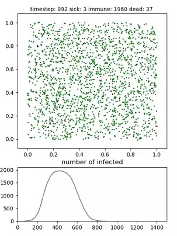
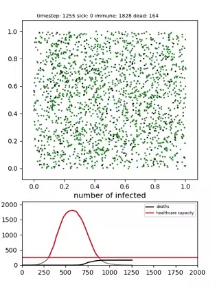
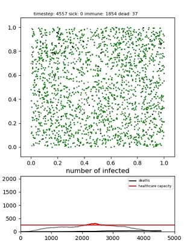

# Python Corona Simulation

After seeing [this article](https://www.washingtonpost.com/graphics/2020/world/corona-simulator/) in the Washington Post I started wondering how such simulations might be done in Python, and indeed if I could expand upon the idea to make them more realistic and fun to play with.

For a moment I thought about writing the simualation itself in pure Python, with matplotlib as visualisation tool. However it quickly became a design goal to be able to simulate large populations as well. 

For large interacting populations, computations can be reduced to vector and matrix operations, something that can be done extremely efficiently through NumPy, which uses both a fast backend written in C, as well as makes use of hardware acceleration features like SIMD (single instruction, multiple data), where many computations can be done on data arrays in relatively few clock cycles.

Aside from that, I've worked with NumPy a lot but felt there was still much to learn, so the challenge became: build such a simulation and improve upon it *using only NumPy* for the computations and matplotlib for the visualisation.

# Simulation runs
Several example videos are included in the repository that highlight various scenarios. First let's start with the examples comparable to the Washington Post article.

## Simple infection simulation
As a first step I built a simulation of a population of randomly moving people. The people stay within the world bounds and each tick there's a 2% chance of them changing heading and speed. There's a 5% chance of becoming sick when getting close to an infected person, and a 2% chance of dying. [The video can be viewed here](videos/simple_simulation_01.mp4). 

See [simple_simulation.py](simple_simulation.py) for the code.

## Simulating Age Effects and Health Care Capacity
As a second step I incorporated increasing risks with age and a simple representation of a limited capacity healthcare system. The following parameters are active in the demo simulation (all are settable). 

- population consists of 2000 individuals
- the population's age follows a gaussian with a mean 45 and max of 105
- there is a 3% chance of becoming infected when being near an infected person
- baseline mortality is 2%
- mortality chances start increasing at age 55, going up exponentially up to 10% at age 75 and beyond
- healthcare capacity is 300 beds
- when in medical treatment: mortality chance is halved
- when _not_ in medial treatment: mortality chance increases threefold. 
	- ***note*** that this affects the elderly disproportionally as their baseline risk is already higher to start with.

See [simulation.py](simulation.py) for the code and settable parameters.

The first simuation run shows a population that simply keeps doing their normal thing and moving around, [find the video here](videos/Simulation_lowcapacity_fastmovement.mp4)

As you can see in the simulation still below, the healthcare system becomes completely overwhelmed, leading to 164 dead (8.2% of the population)

The second simulation has the same settings, but to simulate people staying at home when possible, mobilty is greatly reduced. [See the video here](videos/Simulation_lowcapacity_limitedmovement.mp4)

As you can see in this simulation, while at some point healthcare capacity was overasked slightly, the effects on mortality remain low at 37 dead in this run (1.85%).

