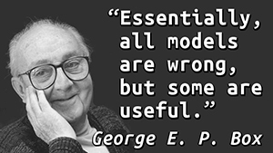
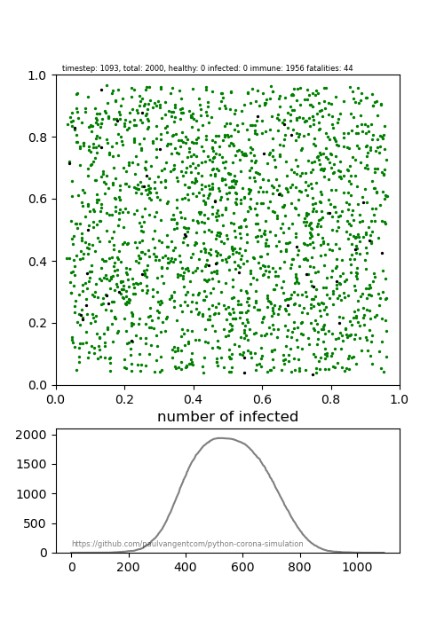
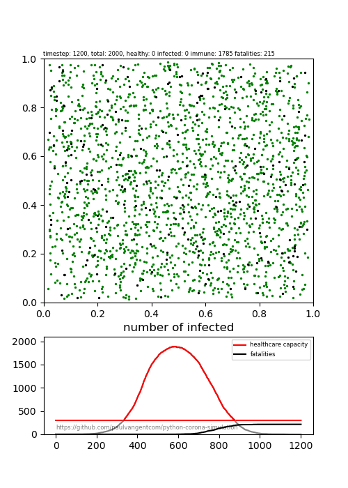
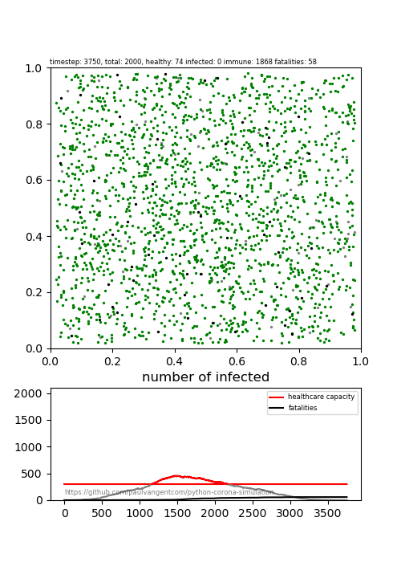
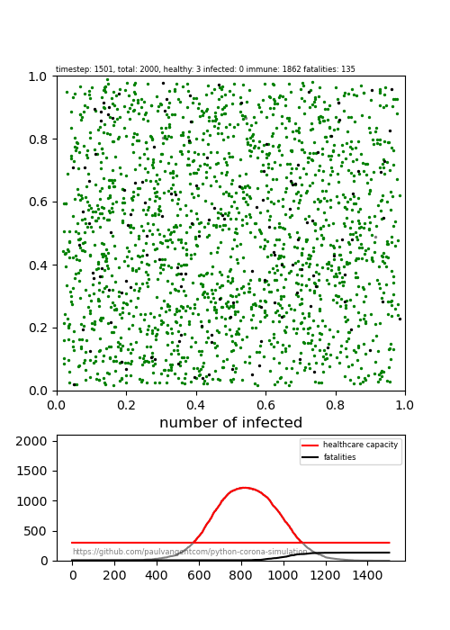

# Python Corona Simulation

After seeing [this article](https://www.washingtonpost.com/graphics/2020/world/corona-simulator/) in the Washington Post I started wondering how such simulations might be done in Python, and indeed if I could expand upon the idea to make them more realistic and fun to play with.

For a moment I thought about writing the simualation itself in pure Python, with matplotlib as visualisation tool. However it quickly became a design goal to be able to simulate large populations as well. 

For large interacting populations, computations can be reduced to vector and matrix operations, something that can be done extremely efficiently through NumPy, which uses both a fast backend written in C, as well as makes use of hardware acceleration features like SIMD (single instruction, multiple data), where many computations can be done on data arrays in relatively few clock cycles.

Aside from that, I've worked with NumPy a lot but felt there was still much to learn, so the challenge became: build such a simulation and improve upon it *using only NumPy* for the computations and matplotlib for the visualisation.

# Simulation runs

## Index
- [Simple infection simulation](#simple-infection-simulation)
- [Simulating Age Effects and Health Care Capacity](#simulating-age-effects-and-health-care-capacity)
	- [Case: 'Business As Usual'](#case-'business-as-usual')
	- [Case: 'Reduced Interaction'](#case-'reduced-interaction')
	- [Case: 'Lock-Down'](#case-'lock-down')
	- [Case: 'Self-Isolation'](#case-'self-isolation')
	- [Self-Isolation in Detail](#self-isolation-in-detail)
	
	
*For reproducibility of all simulations, numpy's seed has been set to '100' in all simulations*

And keep in mind:

## Simple Infection Simulation
As a first step I built a simulation of a population of randomly moving people. The people stay within the world bounds and each tick there's a 2% chance of them changing heading and speed. There's a 3% chance of becoming sick when getting close to an infected person, and a 2% chance of a fatal ending. [The video can be viewed here](videos/simple_simulation_01.mp4). 

See [simple_simulation.py](simple_simulation.py) for the code.

As you can see the virus managed to spread really quickly and almost got infected. In this simulation run one person got lucky and never got infected. 

## Simulating Age Effects and Health Care Capacity
Reality is of course more complex. Let's incorporate increasing risks with age, as well as a simple representation of a limited capacity healthcare system. Both affect mortality during a pandemic: the elderly are vulnerable, and once the healthcare system becomes overwhelmed a lot of people start dying. The following parameters are active (all are or course settable):

- the population's age follows a gaussian with a mean 55, SD of 1/3 the mean, and max of 105
- population consists of 2000 individuals
- there is a 3% chance of becoming infected when being near an infected person
- baseline mortality is 2%
- mortality chances start increasing at age 55, going up exponentially up to 10% at age 75 and beyond
- healthcare capacity is 300 beds
- when in medical treatment: mortality chance is halved
- when _not_ in medial treatment: mortality chance increases threefold. 
	- ***note*** that this affects the elderly disproportionally as their baseline risk is already higher to start with.

### Case: 'Business As Usual'

See [simulation.py](simulation.py) for the code and settable parameters.

The first simuation run shows a population that simply keeps doing their normal thing and moving around, [find the video here](videos/Simulation_lowcapacity_fastmovement.mp4)

As you can see in the simulation still below, the healthcare system becomes completely overwhelmed, leading to 175 dead (8.75% of the population). Three got lucky and escaped infection by pure chance.

### Case: 'Reduced Interaction'

The second simulation has the same settings, but to simulate people staying at home whenever possible and only going out when they have to, mobilty is greatly reduced. [See the video here](videos/Simulation_lowcapacity_limitedmovement.mp4).

As you can see in this simulation, while at some point healthcare capacity was overasked, the effects on mortality remain low at 58 dead in this run (2.9%). That's a little over 3x less dead.

### Case: 'Lock-Down'
Let's simulate a lock-down once 5% of the population is infected. Because some professions are considered critical and these people will still be on the move and in contact with other people. Besides that, because people are people, no lock-down will be perfect. To simulate this, we will make 90% of the people stop moving once locked-down, the remaining 10% will move with substantially reduced speed to simulate them being more cautious.

Notice that once locked-down, the number of infections still increases for some time. This happens because of some of the healthy people will be locked into the same household with infected people, and thus become infected relatively quickly as well. If one of the moving population members (perhaps a mail man or someone delivering groceries) infects one of a cluster of people locked down together, the disease might spread. This leads to small and isolated outbreaks, which are contained very well through the lock-down.

However, if the lock down is lifted and a new case is introduced, a potential deadly situation quickly develops if no adequeate measures are taken:

In such a situation repeated lock-downs seem inevitable if the infection keeps returning.

### Case: 'Self-Isolation'

Another approach is self-isolation: instructing people who have symptoms to stay at home. This was the initial approach the Dutch government had taken and is the approach in many countries that are not locked down. How effective is such a measure, especially given that not everybody will (or can) follow it? [It turns out people can be infectious to others without manifesting symptoms](https://edition.cnn.com/2020/03/14/health/coronavirus-asymptomatic-spread/index.html), which further complicates such a 'stay home if you feel ill' scenario.

In the simulation, people who are infected will choose to either self-isolate or not (the odds can be set). In the video below, those traveling to the isolation area can not infect others anymore, to simulate that these people are aware of their infection and will take precautions not to infect others:

### Self-Isolation in Detail

The picture here is more complex, as factors such as population density and the percentage of people that break the voluntary quarantaine have a large effect. Let's run the simulation with three population densities ('high': 2000 people on a 1x1 area, 'medium': 2000 people on a 1.5x1.5 area, and 'low': 2000 people on 2x2 area), and let's simulate different compliance percentages. Because the situation is based on randomness, let's do a monte carlo simulation with 100 iterations (increases soon) for each setting, so that we can be reasonably confident of our estimates:

*High population density*:

*Medium population density:*

*Low population density:*

This illustrates the interaction between the density of the population (and thus how many people you come across per time unit), and the percentage of infectious people present in the population. This is what you would expect, as both of these factors affect your odds of running into an infected person. Notice how the plots show a clear 'tipping point': after 'n' number of infections, the virus spread starts accelerating. Reports have been going around that [even without symptoms you can still be contagious](https://edition.cnn.com/2020/03/14/health/coronavirus-asymptomatic-spread/index.html), and (remain contagious for quite some time after recovering](https://www.cbsnews.com/news/coronavirus-can-live-in-your-body-for-up-to-37-days-according-to-new-study/), which makes such a self-isolation scenario risky in the case of COVID-19.

## Simulating Health Care Workers
But this is not the whole story, as healthcare is staffed by healthcare workers. Once the number of cases explodes, healthcare workers suffer from long working hours. This compromises their immune system and leads to more exposure. Once healthcare workers get sick, the already overwhelmed healthcare system _reduces_ in capacity.

*WORK ONGOING AT THIS POINT*

